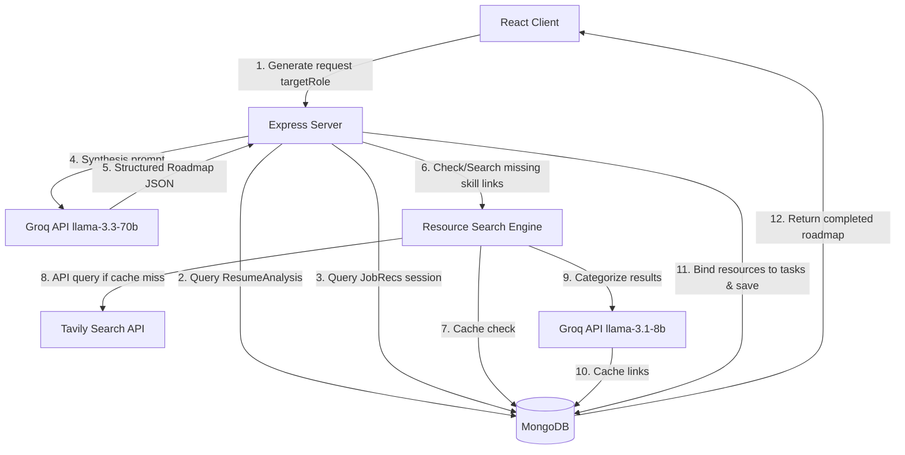

# Jobora (JobTracker) - Premium AI Career Roadmap Documentation

This repository houses **Jobora (JobTracker)**, an advanced AI-powered Career Platform. Below is a comprehensive guide to the architecture, flows, and backend features of our new **AI Career Roadmap** module, designed to guide candidates systematically from their current skillset to their dream target role.

---

## 🏗️ System Architecture & Flow Diagram

The Career Roadmap feature integrates multiple local database caches and remote AI endpoints (Groq + Tavily) to produce and manage personalized learning curriculums.



---

## 🖥️ Complete Frontend Flow

The frontend is built using **React + Vite**, **TypeScript**, **Tailwind CSS**, **Shadcn UI**, and **Framer Motion** for micro-animations. Here is the step-by-step user journey:

### 1. Feature Access & Checkpoints
- The user lands on the **User Dashboard** (`/dashboard`), where a premium card for the **AI Career Roadmap** is displayed.
- Clicking the card redirects to `/roadmap`. The page first runs a checkpoint verification to ensure the user has completed a **Resume Analysis** (which extracts current skills, weaknesses, and experience level).

### 2. Target Role Selection & Generation State
- If no active roadmap exists, the user is presented with a role selector screen. They select a target role (e.g., *DevOps Engineer*, *Software Engineer*, *Cloud Engineer*, or *Data Analyst*) and click **Generate Personalized Roadmap**.
- The interface enters an animated processing state. A custom loading animation sequentially rotates through status highlights:
  1. *Analyzing your current resume skills...*
  2. *Inspecting missing skill gaps against market demand...*
  3. *Querying Tavily search engine for official documentation...*
  4. *Fetching free courses & practice labs references...*
  5. *Building your interactive AI Match simulator...*
  6. *Invoking Coach Groq to write study plans...*

### 3. Interactive Roadmap Navigation Tabs
Once loaded, the view organizes features into five interactive sub-tabs:

#### 📊 Tab A: Progress Hub (Dashboard)
- **Career Progress Ring**: A premium custom SVG radial gauge displaying the completion percentage, count of completed tasks (e.g., `4 of 12`), and upcoming milestone markers.
- **Skill Alignment Matrix**: A side-by-side comparison of **Mastered Skills** (green badges) and **Required Skill Gaps** (yellow badges) dynamically computed from resume profiles.
- **Roadmap Milestones**: Shows unlocked and locked milestone badges:
  - *Ascent Initiated* (25% progress)
  - *Competency Unlocked* (50% progress - Stage 2 unlock threshold)
  - *Elite Practitioner* (75% progress)
  - *Dream-Role Mastered* (100% progress)
- **Skill Demand Trends**: Visualizes the employability match score impact of target skills.

#### 📅 Tab B: Timeline Goals (90-Day Schedule)
- The curriculum is broken down into four tabs:
  - **7 Days** (Immediate Actions)
  - **30 Days** (Short-Term Goals)
  - **60 Days** (Mid-Term Goals) - *Locked until Progress reaches 50%*
  - **90+ Days** (Long-Term Goals) - *Locked until Progress reaches 50%*
- **Stage Unlock Enforcement**: If progress is below 50%, clicking the Mid-Term or Long-Term tab displays a glassmorphic blurred screen with a lock icon prompting the user to complete more beginner items.
- **Expandable Tasks**: Each task includes:
  - Estimated time, difficulty indicators, and bulleted learning objectives.
  - Estimated Match Score and Interview Readiness increases.
  - **Resource Center drawers**: Organizes resources into categorized tabs:
    - *Official Docs*, *Free Courses*, *YouTube Tutorials*, *Practice Labs*, *Hands-on Projects*, *Certifications*, and *Interview Prep*.
- **Progress Tracking Checks**: Toggling a task checkbox immediately triggers the backend update route and animates the radial gauge and milestones dashboard.

#### 🎛️ Tab C: AI Impact Simulator
- An interactive panel displaying a checklist of missing skills and certifications.
- Checking items instantly simulates and animates progress bars for key career metrics:
  - **Match Score** (Baseline + target skills increments)
  - **Interview Probability**
  - **Offer Probability**
  - **Application Success Predictor**

#### 💬 Tab D: Coach Mentor Console
- Displays weekly sprints, certification paths, resume ATS corrections, and recommended portfolio designs.
- **AI Coach Live Chat**: Features a markdown-supported Q&A console. Users can ask custom technical or career questions to Coach Groq and receive instant, structured guidance tailored to their active roadmap.

#### 🧭 Tab E: Career Outlook
- Visualizes projected career pathways, salary limits, market opportunities, and target companies.

---

## ⚙️ Backend Features & Architecture

The backend is built with **Node.js**, **Express**, and **Mongoose (MongoDB)**, using the **Groq SDK** and **Tavily API** for intelligence fetching.

### 1. Database Schemas
- **`LearningResource`** (`backend/models/LearningResource.js`):
  - Indexing: `skill` (Unique, lowercase).
  - Keeps arrays of categorized resources `{ title, url, snippet }` so that if multiple candidates require the same skill (e.g., "Kubernetes"), the system pulls instantly from cache rather than consuming Tavily search credits.
- **`CareerRoadmap`** (`backend/models/CareerRoadmap.js`):
  - Indexing: `userEmail` (Unique).
  - Persists target roles, experience levels, list of completed task IDs, progress percentage, milestone unlock dates, and baseline metrics for the impact simulator.

### 2. Curation & Recommendations Engines
- **Resource Recommendations Engine** (`backend/services/resourceSearchService.js`):
  - In the event of a cache miss for a skill:
    1. Executes a search query via Tavily Search API.
    2. Takes the raw search output and feeds it to Groq's fast model (`llama-3.1-8b-instant`) to evaluate, validate, and group links into the seven resource categories.
    3. Commits the structured links to the MongoDB cache.
- **Roadmap Synthesis Engine** (`backend/services/roadmapService.js`):
  - Calls Groq's primary model (`llama-3.3-70b-versatile`) to generate the complete career roadmap, projects, weekly goals, and simulator deltas in JSON format.
  - Identifies all skills mentioned in the roadmap and runs the resource search service in parallel using `Promise.all` to bind resources to tasks before returning the data.

### 3. Express API Route Endpoints
The endpoints are implemented in `backend/routes/roadmapRoutes.js`:

| Method | Endpoint | Description | Payload / Query |
| :--- | :--- | :--- | :--- |
| **GET** | `/api/roadmap/:email` | Fetches active roadmap. | None |
| **POST** | `/api/roadmap/:email/generate` | Generates a new roadmap. | `{ "targetRole": "DevOps Engineer" }` |
| **POST** | `/api/roadmap/:email/complete-task` | Marks a task completed, updates progress, and unlocks milestones. | `{ "taskId": "imm_1" }` |
| **POST** | `/api/roadmap/:email/uncomplete-task` | Unmarks a task, updates progress, and locks milestones if progress drops. | `{ "taskId": "imm_1" }` |
| **POST** | `/api/roadmap/:email/mentor-ask` | Submits a question to Coach Groq about the roadmap. | `{ "question": "Explain Docker networking" }` |

---

## 🚀 How to Run the Project

### Environment Variables (`.env`)
Make sure your `.env` file in the root directory contains:
```env
MONGO_URI=mongodb+srv://...
PORT=5000
GROQ_API_KEY=gsk_...
TAVILY_API_KEY=tvly-dev-...
```

### Installation & Execution
1. Install dependencies:
   ```bash
   # In root folder (Frontend)
   npm install

   # In backend folder (Backend)
   cd backend && npm install
   ```
2. Run servers locally:
   ```bash
   # Start backend server
   cd backend && npm run dev

   # Start frontend client
   npm run dev
   ```
